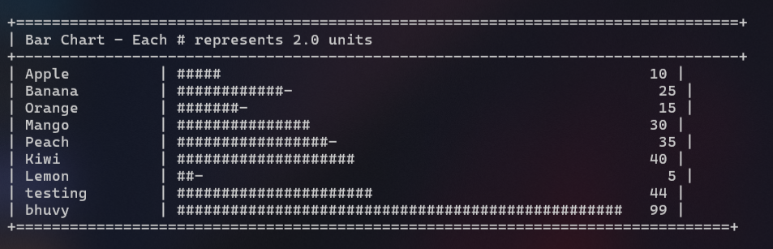

# Data Visualization Tool

A powerful data visualization tool that allows users to view and edit data through both a web interface and a C++ console application. This project was created as a first-year project for CU (Chandigarh University).

## Features

### Web Interface
- Interactive data visualization using Chart.js
- Multiple chart types (Bar, Line, Pie, Doughnut)
- Real-time data updates
- File selection and management
- Responsive design
- Data editing capabilities

### C++ Console Application
- ASCII-based bar chart visualization
- Data file management
- Add/remove data points
- Multiple file support
- Interactive menu system

## Screenshots

### Web Interface
<table>
  <tr>
    <td align="center">
      
      <br>
      <em>Bar Chart Visualization</em>
    </td>
    <td align="center">
      
      <br>
      <em>Line Chart Visualization</em>
    </td>
  </tr>
  <tr>
    <td align="center">
      
      <br>
      <em>Pie Chart Visualization</em>
    </td>
    <td align="center">
      
      <br>
      <em>Data Editing Interface</em>
    </td>
  </tr>
</table>

### C++ Console Application
<table>
  <tr>
    <td align="center">
      
      <br>
      <em>Main Menu Interface</em>
    </td>
    <td align="center">
      
      <br>
      <em>ASCII Bar Chart Visualization</em>
    </td>
  </tr>
  <tr>
    <td align="center" colspan="2">
      
      <br>
      <em>Data Management Interface</em>
    </td>
  </tr>
</table>

## Technologies Used

- Frontend: HTML, CSS, JavaScript, Chart.js
- Backend: C++ (Console Application)
- Data Storage: Plain text files

## Getting Started

### Prerequisites
- Web browser (for web interface)
- C++ compiler (for console application)
- Basic understanding of data files

### Installation

1. Clone the repository:
```bash
git clone https://github.com/Yashraj-Jangra/data_visualizer.git
```

2. For web interface:
   - Simply open `index.html` in your web browser (no web server required)
   - Place data files in the `data` directory
   - The application will work directly in your browser

3. For C++ application:
   - Compile the source code:
   ```bash
   g++ visualization.cpp -o visualizer
   ```
   - Run the executable:
   ```bash
   ./visualizer
   ```

## Usage

### Web Interface
1. Open `index.html` in your browser
2. Select a data file from the dropdown
3. Choose a chart type
4. Edit data using the form below the chart
5. Save changes to update the visualization

### C++ Application
1. Run the executable
2. Use the menu to:
   - Display bar charts
   - Show raw data
   - Add/remove data points
   - Load different data files
   - Exit the application

## Data File Format

Data files should be in the following format:
```
name1 value1
name2 value2
name3 value3
```

Example:
```
Apple 10
Banana 15
Orange 20
```

## Contributing

Contributions are welcome! Please feel free to submit a Pull Request.

## License

This project is licensed under the MIT License - see the LICENSE file for details.

## Author

<div align="center">
  <a href="https://github.com/Yashraj-Jangra">
    
  </a>
  <a href="https://linkedin.com/in/yashraj-jangra">
    
  </a>
</div>

- **Yashraj Jangra** 
  - GitHub: [@Yashraj-Jangra](https://github.com/Yashraj-Jangra)
  - LinkedIn: [Yashraj Jangra](https://linkedin.com/in/yashraj-jangra)

## Acknowledgments

- Chart.js for the web visualization library
- CU (Chandigarh University) for the project opportunity 